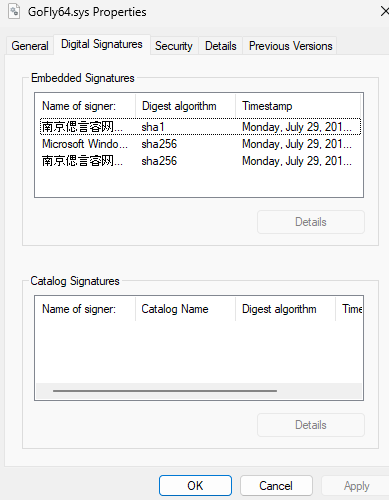

# GoFly64.sys — Microsoft WHQL-Signed BYOVD Vulnerability Analysis [not ended]

A deep-dive technical analysis of the `GoFly64.sys` kernel-mode network filter driver. This driver was developed by a Chinese software company (Nanjing Siyanrui Network Technology) and exhibits highly dangerous, **Insecure by Design** primitives that enable Local Privilege Escalation (LPE) and arbitrary process termination.

## 🔴 The Security Paradox: Microsoft WHQL Signed
Unlike typical third-party drivers signed with standard commercial certificates, `GoFly64.sys` carries an official **Microsoft Windows Hardware Compatibility Publisher** (sha256) digital signature. 



### Structural Validation Failure:
* **Absolute Trust:** Because it is verified by Microsoft, this binary completely bypasses **Driver Signature Enforcement (DSE)** out-of-the-box on any standard Windows 10/11 deployment.
* **AV Blindness:** Traditional Endpoint Detection and Response (EDR) and Anti-Virus (AV) solutions treat this file as a trusted operating system component, resulting in an extremely low static detection rate (**~9/71 on VirusTotal**).

---

## 🛠️ Reversed IOCTL Map & Exploitation Primitives

During our static analysis using IDA Pro, we mapped the core dispatch routine (`IRP_MJ_DEVICE_CONTROL`) and uncovered multiple unauthenticated control channels exposed directly to User-Mode applications.

### 1. Process Termination Primitive (`IOCTL 0x12227A`)
This routine accepts a target Process ID (PID) from the user-mode buffer without any privilege validation.
* **Internal Logic:** The driver explicitly uses **`ZwOpenProcess`** requesting `PROCESS_TERMINATE` access rights (`1u`), followed by an immediate execution of **`ZwTerminateProcess`**.
* **Impact:** Since `Zw`-prefixed system calls originate from Kernel-Mode, the operating system bypasses standard security descriptors (ACLs/DACLs). Non-privileged users can weaponize this IOCTL to instantly terminate protected security solutions (Windows Defender, Kaspersky, EDR agents), blinding the OS.

### 2. Arbitrary Kernel Write / LPE Primitive (`IOCTL 0x122282`)
A critical Write-What-Where flaw hidden deep within the custom command handlers.
* **Internal Logic:** The subroutine `sub_14000BC40` extracts a memory offset/size directly from the user-mode input buffer. It fetches a kernel destination address via an internal helper and executes a blind **`qmemcpy`** up to `0x104` bytes.
* **Impact:** Direct arbitrary kernel memory overwrite without bounds validation. This primitive provides a reliable vector for **Token Stealing** attacks (overwriting the target process access token with the `System` PID 4 token) to achieve an instant Local Privilege Escalation (LPE) to `NT AUTHORITY\SYSTEM`.

### 3. Driver Teardown & Global Race Condition (TOCTOU)

Investigating the driver's deinitialization routine (`sub_14001322C`, bound to driver unload or teardown feature) reveals a critical architecture flaw: **complete lack of thread synchronization (Locks/Spinlocks)** when operating on `g_DriverContext`.

#### Teardown Logic Flow

```cpp
// Reconstructed Unload Routine
if ( g_DriverContext ) {
    g_DriverContext->IsBusy = 0;       // *((_DWORD *)g_DriverContext + 3) = 0;
    g_DriverContext->ActiveStatus = 0; // *((_DWORD *)g_DriverContext + 11) = 0;
}
UnregisterCallbacksOrNotify(&dword_140019510);
CleanupSystemResources();
CloseInternalHandles();
LogTeardownMetrics(v1);

if ( g_DriverContext ) {
    ExFreePoolWithTag(g_DriverContext, 0);
    g_DriverContext = NULL; 
}
```

#### Vulnerability: Kernel Use-After-Free (UAF) / Bug Check (BSOD)

The developer attempts to safely nullify `g_DriverContext` after freeing the memory pool. However, **the pointer is nullified too late**, creating a dangerous Time-of-Check to Time-of-Use (TOCTOU) window.

1. **The Window**: Between the initial flag reset and the actual `ExFreePoolWithTag`, the driver executes multiple heavy internal functions (`sub_140014804` through `sub_140012A80`). During this entire time, `g_DriverContext` remains a completely valid pointer in memory.
2. **The Race**: If a user-mode application spams `IOCTL 0x12227E` (`UpdateDriverContext`) concurrently while the driver is unloading:
   * `UpdateDriverContext` executes `if (g_DriverContext)` check. Since the pointer is not yet NULL, the check **passes**.
   * While `UpdateDriverContext` is writing user-mode data into the structure fields, the unloading thread triggers `ExFreePoolWithTag`.
   * **Result**: `UpdateDriverContext` performs write operations on already freed kernel pool memory, triggering an immediate **Bug Check (BSOD)** or leading to local pool corruption.

### 4. Arbitrary Kernel Memory Disclosure Handler (`sub_14000BC40`)

The driver provides an undocumented primitive allowing user-mode clients to read arbitrary memory blocks directly from the kernel space. This leads to a severe information disclosure vulnerability, allowing attackers to defeat KASLR or leak credentials/tokens.

#### Extended IOCTL Routing Map

Below is the complete mapped IOCTL ecosystem found within the dispatch routine:


| IOCTL Code (HEX) | Transmission Method | Minimum Input Size | Core Functionality |
| :--- | :--- | :--- | :--- |
| `0x12226E` | `METHOD_BUFFERED` | Unknown | Initial Validation / Device Check |
| `0x122272` | `METHOD_BUFFERED` | 6 bytes | Config/Buffer Update via `qmemcpy` |
| `0x122276` | `METHOD_BUFFERED` | 8 bytes | Object Registration / Initialization |
| `0x12227A` | `METHOD_BUFFERED` | 4 bytes | **CRITICAL**: Arbitrary Process Termination (`ZwTerminateProcess`) |
| `0x12227E` | `METHOD_BUFFERED` | 4 bytes | Global Context Update (`UpdateDriverContext`) |
| `0x122282` | `METHOD_BUFFERED` | `0x104` bytes | **CRITICAL**: Kernel Memory Leak / Arbitrary Read Handler |
| `0x122286` | `METHOD_BUFFERED` | Unknown | Post-Operation Cleanup / Metrics |

#### Vulnerability Analysis: Arbitrary Read (`0x122282`)

When evaluating the handler assigned to the memory operations block (`sub_14000BC40`), the execution path safely extracts kernel object base mappings but fails to validate destination constraints:

```cpp
// Reconstructed Vulnerable Code
v3 = findKernelObjByIndex(6581875164, inputBuffer + 1, *inputBuffer);
sub_14000D578(&unk_140019478, v6, &v4);
v1 = sub_14000D200(&unk_140019478, v7);

if ( !sub_14000B16C(v6, v1) ) {
    // Exploitation Vector: 260 bytes leaked directly to User-Mode InputBuffer
    qmemcpy(inputBuffer, getTargetKernelAddress(&unk_140019478, &v5), 0x104);
}
return GetFinalStatus(v8);
```

#### Exploitation Summary
An attacker can crafts a payload specifying a index or token in the first bytes of the input buffer. The driver resolves the target address internally and runs a raw `qmemcpy` operation transferring exactly `260 bytes` (`0x104`) of kernel state structure back into the buffered user-space communication channel without validation boundaries.

#### Appendix: File System Access Primitive (`sub_1400073BC`)

To avoid triggering user-mode file-system filters and routine access control mechanisms, the driver uses a custom kernel wrapper around native `ZwCreateFile` API.

```cpp
// Reconstructed Kernel File Creation/Opening Wrapper
int64_t __fastcall KernelCreateFile(
    struct _IO_STATUS_BLOCK *IoStatusBlock,
    struct _UNICODE_STRING *ObjectPath,
    void *SecurityDescriptor,
    ACCESS_MASK DesiredAccess,
    int Attributes,
    ULONG FileAttributes,
    ULONG ShareAccess,
    ULONG CreateDisposition,
    ULONG CreateOptions,
    PLARGE_INTEGER AllocationSize) 
{
    struct _OBJECT_ATTRIBUTES ObjectAttributes;

    ObjectAttributes.Length = 48; // sizeof(OBJECT_ATTRIBUTES) on x64
    ObjectAttributes.RootDirectory = NULL;
    ObjectAttributes.Attributes = Attributes;
    ObjectAttributes.ObjectName = ObjectPath;
    ObjectAttributes.SecurityDescriptor = SecurityDescriptor;
    ObjectAttributes.SecurityQualityOfService = NULL;

    // Direct invocation bypassing OS User-Mode security boundaries
    return ZwCreateFile(
        (PHANDLE)&IoStatusBlock[1],
        DesiredAccess,
        &ObjectAttributes,
        IoStatusBlock,
        AllocationSize,
        FileAttributes,
        ShareAccess,
        CreateDisposition,
        CreateOptions,
        NULL,
        0);
}
```

This ensures that any filesystem request targeted at `\SystemRoot\System32\drivers\etc\hosts` is executed directly via the kernel executive subsystem, leaving minimal traces for high-level user-mode behavior monitoring tools.


---

## 🚧 Current Status & Future Roadmap

* [x] Reverse-engineer `DriverEntry` and basic IRP major dispatch mapping.
* [x] Document Kernel-level process termination mechanism (`0x12227A`).
* [x] Document Arbitrary Kernel-Write vulnerability (`0x122282`).
* [ ] **[WIP]** Reverse-engineer the Windows Filtering Platform (WFP) network subroutines.
* [ ] Analyze IOCTLs `0x122262` / `0x12226A` / `0x12226E` (Traffic interception and asynchronous packet injection).
* [ ] Perform dynamic verification and capture execution artifacts on an isolated virtual environment.

***
*Disclaimer: This repository is maintained strictly for educational purposes, OS security research, and defensive auditing documentation.*
